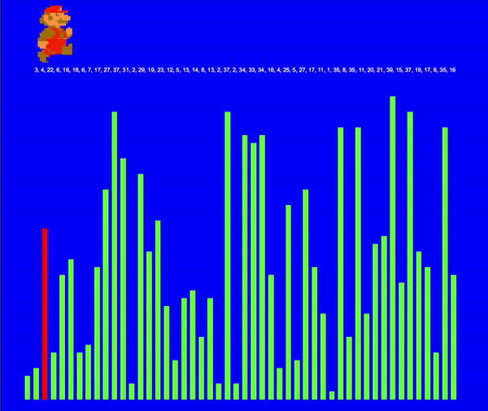

Bubble Sort Demo
----

This is a visual representation of a [bubble sort](https://www.youtube.com/watch?v=k4RRi_ntQc8)

----
### Usage

Move to a temporary directory:

    cd /tmp

Checkout the source code:

    git clone https://github.com/johnyevsukov/bubble_sort_demo.git

Navigate into the repo:

    cd bubble_sort_demo/

Run the visualizer:

    make run

__Note:__ You will need to have Python3 installed and have it available in your PATH.

----
#### Demo

